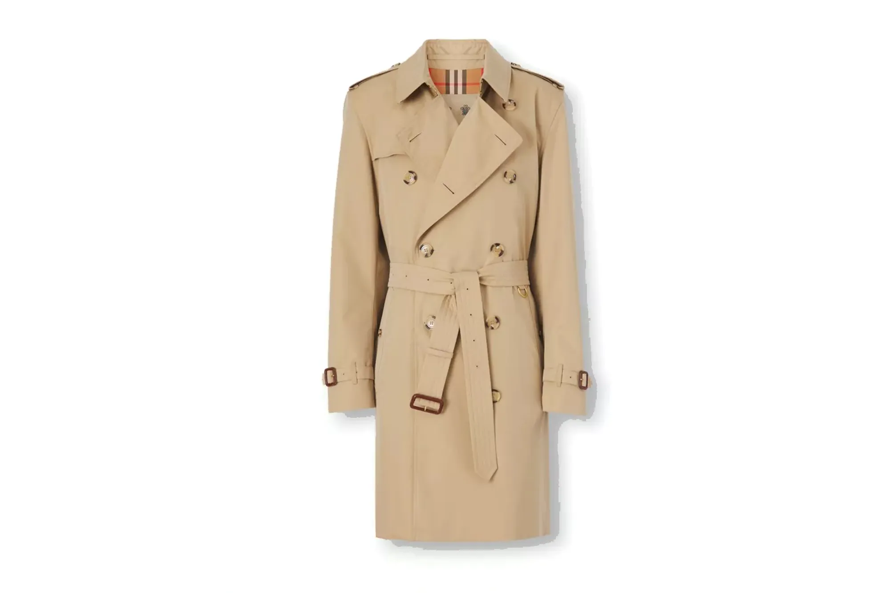
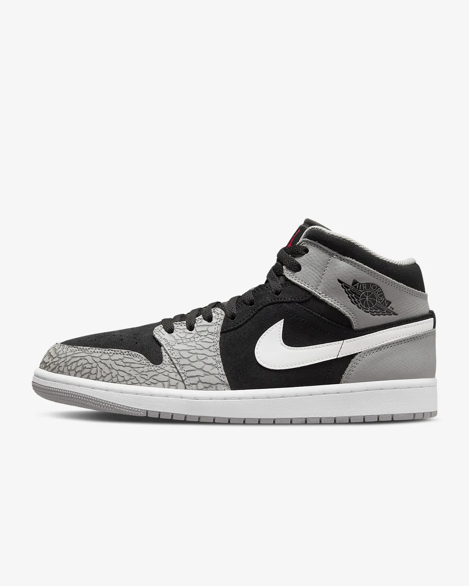

# Check 1

# Check 2

# Check 3

image 1:

<!--  -->

[[6.8437421e-01 2.8475200e-12 2.5633722e-07 9.6590202e-07 5.9132144e-09
  9.3525881e-13 3.1562394e-01 8.1784129e-20 5.4555721e-07 5.5100396e-13]]
  
 

image 2:

[[0.04403941 0.04393813 0.00681597 0.75638545 0.05100959 0.00751661
  0.04127413 0.00142086 0.04217379 0.00542603]]
  

image 3:

[[3.7061030e-04 5.6619913e-04 1.8264326e-03 1.0676402e-04 1.4281319e-03
  4.1578299e-01 2.1146545e-03 5.4818279e-01 1.0924055e-02 1.8697368e-02]]

